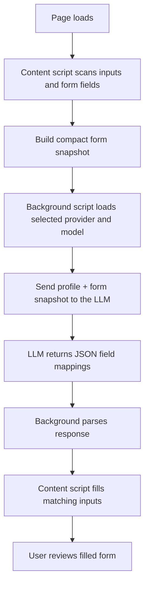

# Intelligent Form Filler Extension

An AI-powered Chrome Extension that automatically fills web forms using your personal profile data and Google Gemini, Anthropic Claude, OpenAI, or a local Ollama model.

Demo : https://jumpshare.com/s/w8f8ybLwfr4OCGLkYpeZ

## Features
- **Auto-Fill**: Automatically detects forms and fills them with your saved details.
- **Context Aware**: Uses Gemini, Claude, OpenAI, or Ollama-hosted models to understand form fields (even with weird names) and map them to your profile.
- **Force Fill**: Manually trigger form filling on difficult pages.
- **Right-Click to Save**: Easily add new fields to your profile by right-clicking them on any webpage.
- **Secure**: Your API keys and data are stored locally in your browser (`chrome.storage.local`).

## Requirements
- **Google Chrome** (or Chromium-based browser).
- **One AI API Key or Local Endpoint**: Use one of the following providers:
   - **Google Gemini API Key** from [Google AI Studio](https://aistudio.google.com/api-keys)
   - **Anthropic API Key** from the [Claude Console](https://platform.claude.com/settings/workspaces/default/keys)
   - **OpenAI API Key** from the [OpenAI Platform](https://platform.openai.com/api-keys)
   - **Ollama** running locally at `http://localhost:11434`

## Installation
1. Clone or download this repository.
2. Open Chrome and go to `chrome://extensions/`.
3. Enable **Developer mode** (top right toggle).
4. Click **Load unpacked**.
5. Select the folder containing this project (the folder with `manifest.json`).

## How to Use
1. **Setup**:
   - Click the extension icon in your toolbar.
   - Choose **Google Gemini**, **Anthropic Claude**, **OpenAI**, or **Ollama Local LM** from the provider selector.
   - Paste the matching API key, or for Ollama enter the local endpoint such as `http://localhost:11434`, then click "Save Config".
   - (Optional) Select a model for the chosen provider.
2. **Create Profile**:
   - Fill in your details (Name, Address, etc.) in the extension popup.
   - Click "**+ Add Field**" to add custom fields (e.g., "LinkedIn", "Portfolio", "Veteran Status").
   - Click "**Save Profile**".
3. **Auto-Filling**:
   - Navigate to a page with a form (e.g., a job application).
   - The extension will automatically try to fill it.
   - If it doesn't fill automatically, open the extension popup and click **Force Auto-Fill Page**.
4. **Saving New Fields**:
   - If you encounter a field you want to save for later, **Right-Click** inside the input box.
   - Select **"Save value to Auto-Fill Profile"**.
   - It will be saved to your profile (you can rename it in the popup later).

5. **Starting from the sample profile**:
   - From the project root, copy the template with `cp dummy_profile.json your_name_profile.json`.
   - Open `your_name_profile.json` and replace the placeholder values with your real details.
   - Use the popup's **Import from JSON** button to load the profile into the extension, then click **Save Profile**.

## How It Works
The LLM is used as a field-mapping engine. The extension does not ask it to browse the page or invent data. Instead, it sends two structured inputs: the user profile and a snapshot of the current form fields.

The model then returns a JSON object that maps each form field to the most likely profile value. The extension applies those returned values directly to the page.

## Troubleshooting
- **Not filling?** Try the "Force Auto-Fill Page" button.
- **Error in console?** Press `F12` to open Developer Tools and look for `[Gemini Auto-Fill]` or provider-specific messages.
- **Quota Exceeded?** Ensure your selected provider API key is valid and has quota.
- **Ollama not responding?** Make sure Ollama is running locally and the selected model exists in your Ollama install.

## Supported Providers
- **Google Gemini**: The extension supports multiple Gemini models, including Gemini 1.5 and Gemini 2.5 variants.
- **Anthropic Claude**: The extension supports Claude models through Anthropic's Messages API, including Claude 3, 3.5, 4, and 4.5 families.
- **OpenAI**: The extension supports OpenAI chat models through the Responses-compatible chat completions endpoint, including GPT-4o and GPT-4.1 variants.
- **Ollama**: The extension supports local models exposed by Ollama's `/api/chat` endpoint.

## Config File Import
- You can import a JSON profile that contains either `geminiApiKey` or `anthropicApiKey`.
- You can also import `openaiApiKey` or `ollamaEndpoint` if you want to save those provider settings in a JSON file.
- If both keys are present, the extension will keep both and use the selected provider when filling forms.
